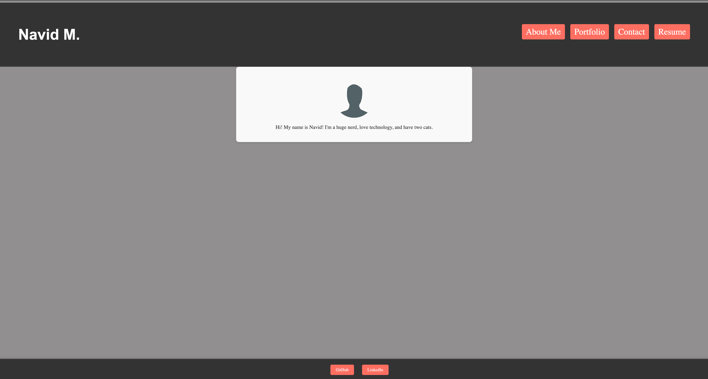

#react-portfolio

Description
We were tasked in our Bootcamp to create a React porfolio from scratch 

Usage
To use the skills we've learned in class to build out a portfolio using React.

Credits
 Stackoverflow, w3schools, https://docs.netlify.com/

License
None

Questions:
Feel free to reach out on Github for further questions: nmahban
